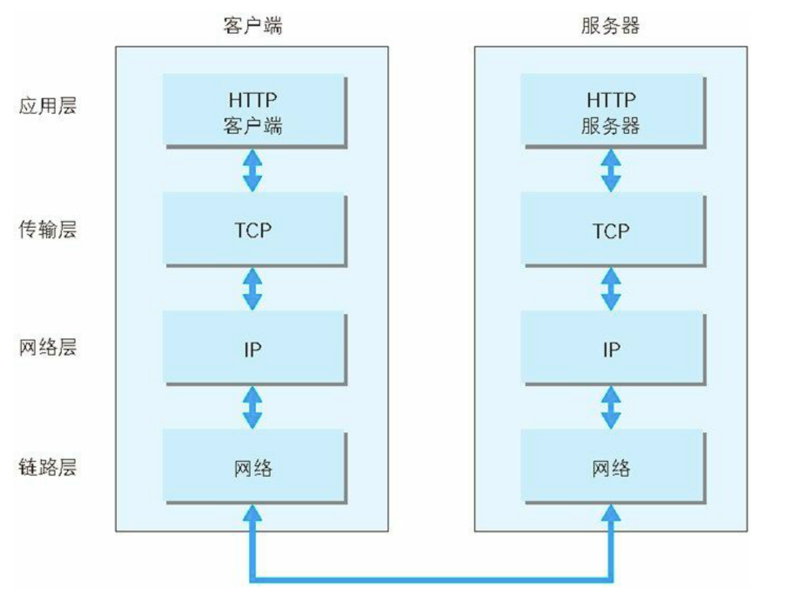
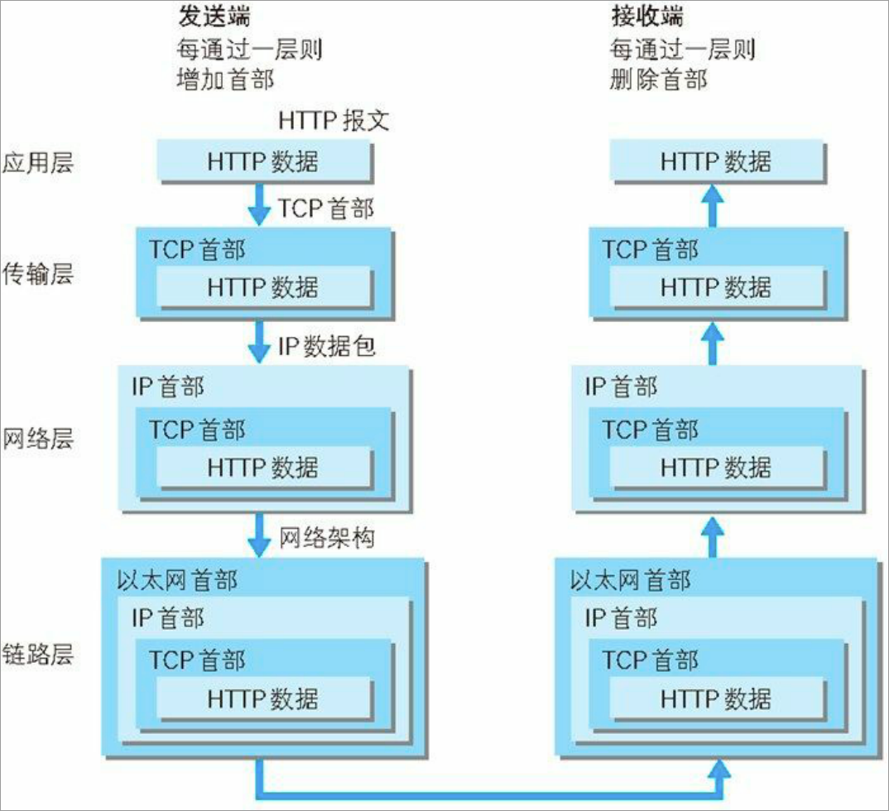
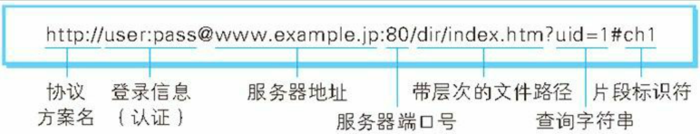

# 一、**了解 Web 及网络基础**

Web 是建立在何种技术之上，以及 HTTP 协议是如何诞 生并发展的

HTTP（HyperText Transfer Protocol，超文本传输协议）

## 1、网络基础 **TCP/IP**

通常使用的网络（包括互联网）是在 TCP/IP 协议族的基础上运作 的。而 HTTP 属于它内部的一个子集。

- 1）**TCP/IP** 协议族
    - 计算机与网络设备要相互通信，双方就必须基于相同的方法、或者规则，统称为 协议（protocol）
    - 而 **TCP/IP** 是互联网相关的各类协议族的总称

- 2）**TCP/IP** 的分层管理
    
    
    族按层次分别分 为以下 4 层：应用层、传输层、网络层和数据链路层
    
    优点：逻辑清晰，修改与设计简单，自由度高，
    
    **应用层**：
    
    - 应用层决定了向用户提供应用服务时通信的活动。
    - FTP（File Transfer Protocol，文件传输协议）
    - DNS（Domain Name System，域名系统）
    - HTTP（HyperText Transfer Protocol，超文本传输协议）
    
    **传输层** 
    
    - 传输层对上层应用层，提供处于网络连接中的两台计算机之间的数据 传输。
    - TCP（Transmission Control Protocol，传输控制协议）
    - UDP（User Data Protocol，用户数据报 协议）
    
    **网络层**（又名网络互连层）
    
    - 来处理在网络上流动的数据包。数据包是网络传输的最小数 据单位。
    
    **链路层**（又名数据链路层，网络接口层）
    
    - 来处理连接网络的硬件部分，操作系统、硬件的设备驱，网卡，光纤，等硬件上的范畴均在 链路层的作用范围之内。

- 3）**TCP/IP** 通信传输流
    
    
    TCP/IP 协议族进行网络通信时，会通过分层顺序与对方进行通信。
    
    发送端从应用层往下走，接收端则往应用层往上走。
    
    
    
    
    
    发送端在层与层之间传输数据时，每经过一层时必定会被打上一个该 层所属的首部信息。
    
    反之，接收端在层与层传输数据时，每经过一层 时会把对应的首部消去。 
    
    这种把数据信息包装起来的做法称为封装（encapsulate）。
    

- 4）与 **HTTP** 关系密切的协议 **: IP**、**TCP** 和 **DNS**
    
    负责传输的 **IP** 协议（网络层）
    
    IP（Internet Protocol）网际协议作用是把各种数据包传送给对方，
    
    IP 地址 和 MAC 地址 是保证传送的两个重要条件
    
    IP 地址指明了节点被分配到的地址，MAC 地址是指网卡所属的固定 地址。
    
    IP 地址可以和 MAC 地址进行配对。
    
    IP 地址可变换，但 MAC 地址基本上不会更改
    
    ARP 协议（Address Resolution Protocol）
    
    ARP 是一种用以解析地址的协议，根据通信方 的 IP 地址就可以反查出对应的 MAC 地址。
    
    确保可靠性的 **TCP** 协议（传输层）
    
    提供可靠的字节流服务
    
    为了准确无误地将数据送达目标处，TCP 协议采用了三次握手 （three-way handshaking）策略
    
    TCP 的握手标志（flag） —— SYN（synchronize） 和 ACK（acknowledgement）
    
    负责域名解析的 **DNS** 服务（应用层）
    
    提供通过域名 查找 IP 地址，或逆向从 IP 地址反查域名的服务
    

- 5）**URI** 和 **URL**
    
    URI（Uniform Resource Identifier，统一资源标识符）
    
    是由某个协议方案表示的资源的定位标识符。协议方案是指访问资源所使用的协议类型名称。
    
    URL（Uniform Resource Locator，统一资源定位符）
    
    URL表示资源的地点（互联 网上所处的位置）
    
    URL是 URI 的子集
    
    **URI** 格式
    
    
    

## 2、**简单的 HTTP 协议**

**HTTP** 协议用于客户端和服务器端之间的通信，通过请求和响应的交换达成通信

**HTTP** 是不保存状态的协议，是为了 更快地处理大量事务，确保协议的可伸缩性

- 告知服务器意图的 **HTTP** 方法
    - **GET** ：获取资源
        
        求访问已被 URI 识别的资源
        
    - **POST**：传输实体主体
    - **PUT**：传输文件
    - **DELETE**：删除文件
    - **OPTIONS**：询问支持的方法
        
        来查询针对请求 URI 指定的资源支持的方法
        
    - **HEAD**：获得报文首部
        
        和 **GET** 一样，但不返回报文主体
        
    - **TRACE**：追踪路径
    - **CONNECT**：要求用隧道协议连接代理
  
### 3、**返回结果的 HTTP 状态码**

- 1）状态码的类别
    - 1XX Informational（信息性状态码） 接收的请求正在处理
    - 2XX Success（成功状态码） 请求正常处理完毕
    - 3XX Redirection（重定向状态码） 需要进行附加操作以完成请求
    - 4XX Client Error（客户端错误状态码） 服务器无法处理请求
    - 5XX Server Error（服务器错误状态码） 服务器处理请求出错

- 2）**2XX** 成功
    
    2XX 的响应结果表明请求被正常处理了
    
    - **200 OK**
        - 表示从客户端发来的请求在服务器端被正常处理了
    - **204 No Content**
        - 服务器接收的请求已成功处理，但在返回的响应报文中 不含实体的主体部分。
    - **206 Partial Content**
        - 该状态码表示客户端进行了范围请求，而服务器成功执行了这部分的 GET 请求，响应报文中包含由 Content-Range 指定范围的实体内容

- 3）**3XX** 重定向
    
    3XX 响应结果表明浏览器需要执行某些特殊的处理以正确处理请 求。
    
    - **301 Moved Permanently**
        - 永久性重定向。该状态码表示请求的资源已被分配了新的 URI，以后 应使用资源现在所指的 URI。
    - **302 Found**
        - 临时性重定向。该状态码表示请求的资源已被分配了新的 URI，希望 用户（本次）能使用新的 URI 访问。
    - **303 See Other**
        - 由于请求对应的资源存在着另一个 URI，应使用 GET 方法定向获取请求的资源
    - **304 Not Modified**
        - 客户端发送附带条件的请求时，服务器端允许请求访 问资源，但未满足条件的情况
        - 附带条件的请求是指采用 GET方法的请求报文中包含 If-Match，If-Modified- Since，If-None-Match，If-Range，If-Unmodified-Since 中任一首部
    - **307 Temporary Redirect**
        - 临时重定向。该状态码与 302 Found 有着相同的含义。

- 4）**4XX** 客户端错误
    
    4XX 的响应结果表明客户端是发生错误的原因所在
    
    - **400 Bad Request**
        - 请求报文中存在语法错误
    - **401 Unauthorized**
        - 示发送的请求需要有通过 HTTP 认证（BASIC 认证、 DIGEST 认证）的认证信息。另外若之前已进行过 1 次请求，则表示 用 户认证失败。
    - **403 Forbidden**
        - 对请求资源的访问被服务器拒绝了
    - **404 Not Found**
        - 服务器上无法找到请求的资源，或者服务器端拒绝请求且不想说明理由时使用

- 5）**5XX** 服务器错误
    
    5XX 的响应结果表明服务器本身发生错误。
    
    - **500 Internal Server Error**
        - 服务器端在执行请求时发生了错误，也有可能是 Web 应用存在的 bug 或某些临时的故障。
    - **503 Service Unavailable**
        - 服务器暂时处于超负载或正在进行停机维护，现在无法 处理请求。

**4、与 HTTP 协作的 Web 服务器**

- 1）用单台虚拟主机实现多个域名
    
    在相同的 IP 地址下，由于虚拟主机可以寄存多个不同主机名和域名 的 Web 网站，因此在发送 HTTP 请求时，必须在 Host 首部内完整指 定主机名或域名的 URI。
    

- 2）通信数据转发程序：代理、网关、隧道
    
    HTTP 通信时，一些用于通信 **数据转发** 的应用程序，可以配合服务器工作，可将请求转发给通信线路上的下一站服务器，并且能接收从那台服务器发送的响应再转发给客户端。
    
    - 代理
        - 代理是一种有转发功能的应用程序，接收由客户端发送的请求并转发给服务器，同时也接收服务器返回的响应并转发给客户端。
        - 代理服务器接收客户端发送的请求后转发给其他服务器。
        - 代理不改变请求 URI，会直接发送给前方持有资源的目标服务器。
        - 持有资源实体的服务器被称为源服务器。
        - 从源服务器返回的响应经过代理服务器后再传给客户端。
        - 使用理由
            - 利用缓存技术（稍后讲解）减少网络带宽的流量，组织内部针对特定网站的访问控制，以获取访问日志为主要目的，等等
        - 是否使用缓存（缓存代理）
            - 代理转发响应时，缓存代理（Caching Proxy）会预先将资源的副本 （缓存）保存在代理服务器上。
            - 当代理再次接收到对相同资源的请求时，就可以不从源服务器那里获 取资源，而是将之前缓存的资源作为响应返回。
        - 是否会修改报文（透明代理）
            - 转发请求或响应时，不对报文做任何加工的代理类型被称为透明代理 （Transparent Proxy）。
            - 反之，对报文内容进行加工的代理被称为非 透明代理。
    
    - 网关
        - 网关是转发其他服务器通信数据的服务器，接收从客户端发送来的请求时，它就像自己拥有资源的源服务器一样对请求进行处理。
        - 利用网关可以由 **HTTP** 请求转化为其他协议通信
    
    - 隧道
        - 隧道是在相隔甚远的客户端和服务器两者之间进行中转，并保持双方 通信连接的应用程序。
        - 可按要求建立起一条与其他服务器的通信线路，届时使用 SSL等 加密手段进行通信
        - 目的是确保客户端能与服务器进行安全的 通信。
        - 请求保持原样中转给之 后的服务器
        - 隧道会在通信双方断开连接时结束
    

- 3）保存资源的缓存
    
    
    缓存是指代理服务器或客户端本地磁盘内保存的资源副本
    
    当代理转发从服务器返回的响应时，代理服务器将会保存一份资 源的副本。
    
    优势：利用缓存可减少对源服务器的访问，因此也就节省了通信流量和通信时间
    
    - 效期限
        - 会因为客户端的要求、缓存的有效期等，向源服务器确认资源的有效性
        - 若判断缓存失效，缓存服务器将会再次从源服务器上获取“新”资源。
    
    - 客户端的缓存
        - 当判定缓存过期后，会向源服务 器确认资源的有效性。
        - 若判断浏览器缓存失效，浏览器会再次请求新 资源。

5、**HTTP 首部**

1）**HTTP** 报文首部

- **HTTP** 请求报文
    - 方法、URI、HTTP 版本、HTTP 首部字段等 部分构成
- **HTTP** 响应报文
    - HTTP 版本、状态码（数字和原因短语）、 HTTP 首部字段

2）**HTTP** 首部字段

- **HTTP** 首部字段传递重要信息
    - 为了给浏览器和服务器提供报文主体大小、所使用的 语言、认证信息等内容
- **HTTP** 首部字段结构
    - 由首部字段名和字段值构成的，中间用冒号“:” 分 隔
- 重复了会如何
    - 根据浏览器内部处理逻辑 的不同，结果可能并不一致
- HTTP 首部字段根据实际用途被分为以下 4 种类型
    - 通用首部字段（**General Header Fields**）： 请求报文和响应报文两方都会使用的首部。
    - 请求首部字段（**Request Header Fields**）：从客户端向服务器端发送请求报文时使用。补充了附加内容、客户端信息、响应内容相关优先级等
    - 响应首部字段（**Response Header Fields**）：从服务器端向客户端返回响应报文时使用的首部。补充了附加内容，也会要求客户端附加额外的内容信息。
    - 实体首部字段（**Entity Header Fields**）： 针对请求报文和响应报文的实体部分使用的首部。补充了资源内容更 新时间等与实体有关的信息。

3）**HTTP/1.1** 通用首部字段

**Cache-Control**

通过指定首部字段 Cache-Control 的指令，就能操作缓存的工作机制。

- 缓存请求指令
    
    
    | 指令   | 参数 | 说明 |
    | --- | --- | --- |
    | no-cache   | 无 | 强制向源服务器再次验证 |
    | no-store   | 无 | 不缓存请求或响应的任何内容 |
    | max-age = [ 秒]   | 必需 | 响应的最大Age值 |
    | max-stale( = [ 秒])   | 可省略 | 接收已过期的响应 |
    | min-fresh = [ 秒]   | 必需 | 期望在指定时间内的响应仍有效 |
    | no-transform   | 无 | 代理不可更改媒体类型 |
    | only-if-cached  | 无 | 从缓存获取资源 |
    | cache-extension  | - | 新指令标记（token） |
- 缓存响应指令
    
    
    | 指令   | 参数 | 说明 |
    | --- | --- | --- |
    | public | 无 | 可向任意方提供响应的缓存 |
    | private | 可省略 | 仅向特定用户返回响应 |
    | no-cache | 可省略 | 缓存前必须先确认其有效性 |
    | no-store | 无 | 不缓存请求或响应的任何内容 |
    | no-transform | 无 | 代理不可更改媒体类型 |
    | must-revalidate | 无 | 可缓存但必须再向源服务器进行确认 |
    | proxy-revalidate  | 无 | 要求中间缓存服务器对缓存的响应有效性再进行确认  |
    | max-age = [ 秒] | 必需 | 响应的最大Age值 |
    | s-maxage = [ 秒] | 必需 | 公共缓存服务器响应的最大Age值 |
    | cache-extension | -  | 新指令标记（token） |

**public** 指令